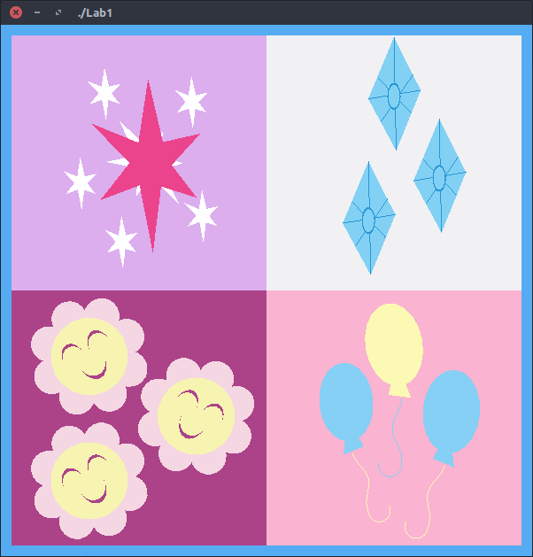
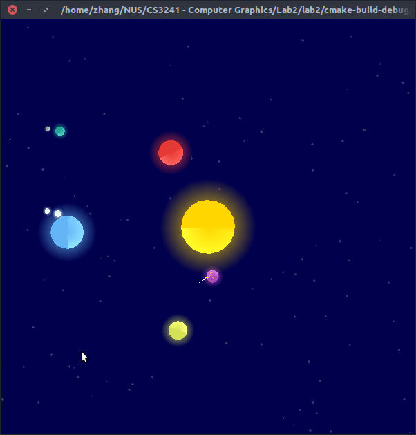
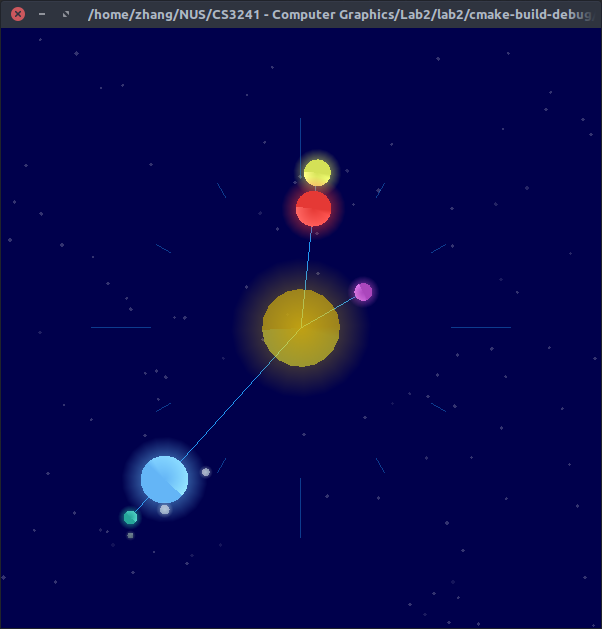
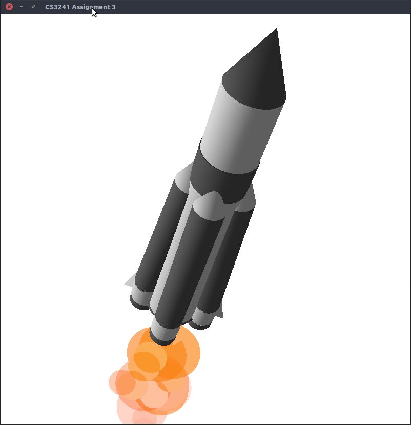
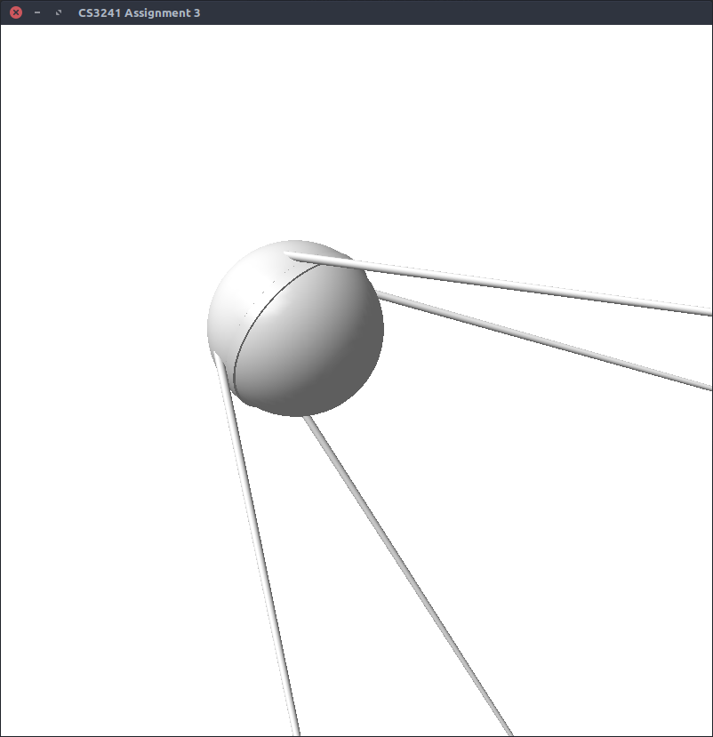
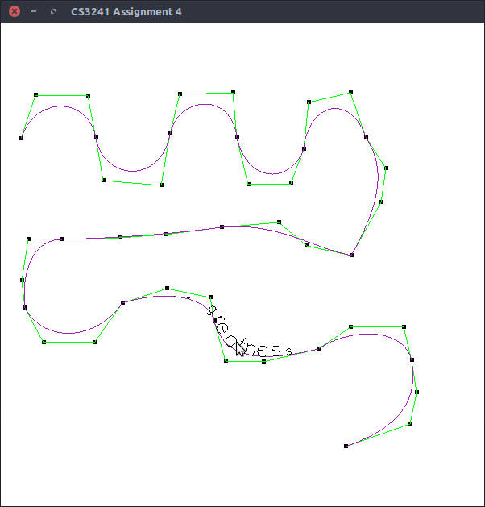
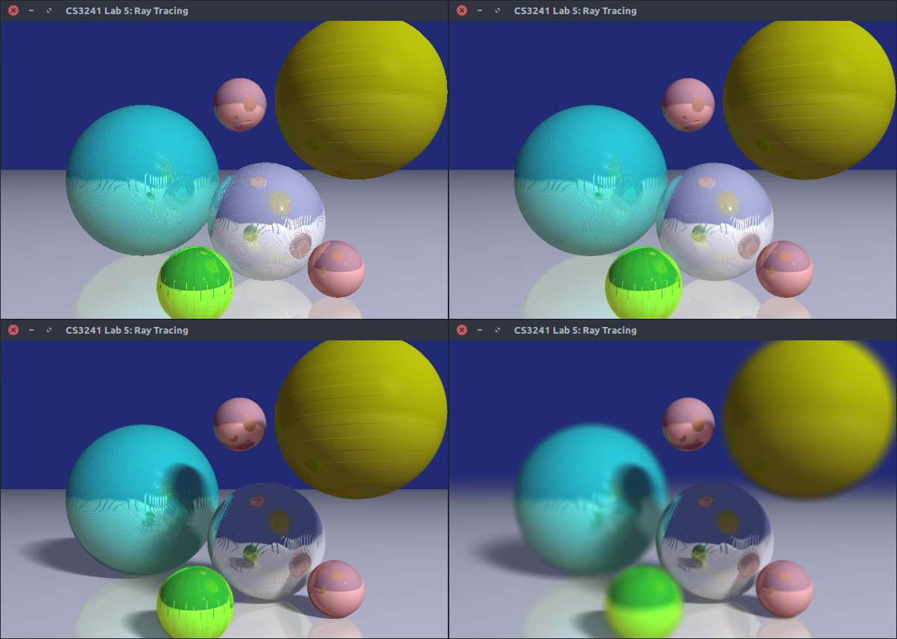

# CS3241 Computer Graphics Lab Assignment Submissions 

These are my submissions for AY16/17 CS3241 Computer Graphics. If you are a 
current student, it would be best not to look at the code to avoid plagerism,
but instead read about how the feature is implemented and do it from scratch
yourself to avoid accidental plagiarism. 

Note that the techniques used in these code are not necessarily industry best
practice, due to the course requirements (both in code organization and use of 
certain OpenGL features), coding expedency and [Visual Studio 2013's spotty 
support for C++13](https://msdn.microsoft.com/en-us/library/hh567368.aspx). 

## To build

Code is tested on Ubuntu 17.10 with gcc 7.2.0 and cmake version 3.9.1, and 
Visual Studio 2013 on Windows 7. OpenGL/GLUT is required - for Linux, 
[FreeGLUT][freeglut] is used instead of GLUT.

## Useful tools and resources for CS3241 

- Hex to OpenGL RGB color converter: https://openglcolor.mpeters.me/ 
- OpenGL basics from NTU: http://www3.ntu.edu.sg/home/ehchua/programming/opengl/cg_introduction.html
- OpenGL 4.5 reference: 
  https://www.khronos.org/registry/OpenGL-Refpages/gl4/

For the raytracing assignment: 

- Scratchapixel article on building a minimal raytracer: 
  https://www.scratchapixel.com/lessons/3d-basic-rendering/minimal-ray-tracer-rendering-simple-shapes
- Wikipedia's article on spherical and cylinder coordinate system: 
  https://en.wikipedia.org/wiki/Spherical_coordinate_system
- Parametric surfaces tutorial: 
  http://tutorial.math.lamar.edu/Classes/CalcIII/ParametricSurfaces.aspx
- Computer graphics lecture notes from University of Michigan covering bump 
  and texture mapping:
  https://web.eecs.umich.edu/~sugih/courses/eecs487/lectures/26-BumpMap+ProcTex.pdf

## Assignments 

### Lab 1 - Doodle 

*Cutie marks of various characters from My Little Pony: Friendship is Magic. 
Clockwise from top left: Twilight Sparkle, Rarity, Cheerilee, Pinkie Pie*

- Techniques used: OpenGL drawing primitives, basic transformation and 
  coloring 

Nothing much here, just hard coding in a bunch of vertices to draw each of 
the shapes and using transformations to move them into the correct places.

### Lab 2 - The World is Round!

 

*Left: A rocket being launched from the purple planet, showing off the
particle emitter.  
Right: In clock mode, the planets align to form the hands of a clock*

- Techniques used: Layered transformation, alpha transparency, basic 
  and physics-based animation

Object-orientated programming is really useful here to keep things sane. 
The code is divided into classes for the stars in the background, the rocket,
the particle emitter and particles, and the planets themselves (moons are
planets). 

- Stars: When the program launches, fill the stars vector with Star objects.
  Each Star object is a simple state machine: at each tick, if a star is at
  full brightness, it may start twinkling with a random probability. 
  Twinkling is done by slowly decreasing then increasing the opacity of the 
  star, both of which are states encoded in the state machine. When the 
  star reaches full opacity again, the state is returned to the original.

- Glow: Draw a circle with a fully opaque center, and fully transparent
  outer vertices, then draw the planet in front of the circle. This produces a 
  surprisingly convincing glow effect around the planet.

- Particles: Each particle is an individual object, managed by the emitter.
  Over the lifetime of the particle, its opacity decreases until it reaches 
  zero, at which point it is removed. It would be more efficient to set up a 
  object pool of particles, but that would make the code more complicated. 

- Rocket physics: On each tick, calculate the acceleration due to each
  of the planets (direction: vector from rocket to planet; magnitude: Newton's
  gravitational equation), plus the rocket's own delta-vee if the thrusters 
  are firing (direction: vector from rocket to mouse position; magnitude: a 
  fixed constant). Planet mass is assumed to be proportional to planet radius, 
  and the constant of proportionality is rolled into the gravitational 
  constant. 

  Collision detection is done by simply looping through each planet and 
  checking that the euclidean distance from the rocket is larger than the
  planet's radius. 

- Unfortunately physics-based interactivity is not a very good idea with GLUT,
  since the library has no guarentee on the interval between update ticks. This
  means the program actually behaves differently on faster machines! You can 
  compensate for this by calculating the delta time using the wall clock at 
  every update tick instead, but this will cause the game to look janky at low
  framerates. 

### Lab 3 - Let there be light!

 

*Left: The rocket that carried Sputnik into orbit.  
Right: Sputnik-1, the first artifical satellite in human history.*

- Techniques used: OpenGL materials, 3D polygons and 3D transformations 

It's the 60th anniversary of the launch of Sputnik-1, and what better 
way to celebrate than with a 3D rendering of the famous satellite and the 
rocket that brought it into orbit? 

- The objects slowly spin to show them off. This is done by rotating them
  along the up-vector every tick. 

- The rocket is composed entirely of cylinders - cones are cylinders with a 
  radius of zero on one end. 

- The particle emitter from the previous assignment is recycled to generate 
  the exhaust flame. The particles are semi-transparent 2D discs whose colors
  animate from yellow to red. 

- Camera shake effect is done by simply displacing the camera's position by a
  random amount every frame. 

- Sputnik itself is simply a sphere with four slender cylinders to make up 
  the antennas. 

### Lab 4 - Let's get twisted! 

*A bezier curve with parts of the famous Shakespeare quote draw on it - "Be not
afraid of greatness: some are born great, some achieve greatness and some have 
greatness thrust upon them"* 

- Techniques used: Bezier curve, vector math, GLUT text rendering 

Couldn't really think of what to draw, so I went back to the good old classic 
of drawing text on a curve, with a Shakespeare quote chosen for maximum 
pretensiousness. 

Note that `glutStrokeCharacter()` is required here - `glutBitmapCharacter()` 
does not work. To make it a bit more interesting, I made it interactive by 
making the font size inversely proportional to the distance from mouse, which 
means the user has to trace their mouse over the entire curve to read the full
quote. 

### Lab 5 - To Infinity and Beyond!

*Four screens showing different rendering techniques when used to draw a bunch 
of spheres sitting on a plane*

- Top left: Original 
- Top right: With 2x2 supersampling 
- Bottom left: With 2x2 supersampling and soft shadows
- Bottom right: With 2x2 supersampling, soft shadows and depth of field 

--- 

- Techniques used: Raytracing, bump mapping, soft shadows, supersampling, 
  depth of field 

This is probably the assignment that requires the most math. Here are the 
methods used to 

#### Bump mapping

First, find a way to map points on the surface of the sphere from the 
intersection coordinate to the 2D heightmap array. This is done by 
converting the cartesian coordinate to spherical coordinates, and 
interpolating theta and phi to the width and height of the heightmap. 
    
    theta = acos(N_y / r)
    phi = atan2(N_x, N_z)
    u = (theta / pi) * MAP_SIZE 
    v = (phi / (2 * pi) + 0.5) * MAP_SIZE

Since we're using a heightmap, we need to convert that into gradient. 
This is done by simply taking the difference between the cell above and
below, and right and left of the current grid cell. 

    du = bumps[v][u+1] - bumps[v][u-1]
    dv = bumps[v+1][u] - bumps[v-1][u]
    
This can also be pre-computed to save time. 

Next, find out how to perturb the normal vector. You need two orthogonal
vectors to the normal to do this. The two vectors should be longitudinal
(parallel to the equator) and latitudinal (connecting the two poles). 
The longitudinal vector is easier to calculate, since it lies on the XZ
plane, and since the vectors are orthogonal, we can take the cross product
of the normal and the longitude to calculate the last vector. 

    V_long = (N_x / N_z, 0, N_y / r)
    V_lat = cross_prod(V_long, normal)

and finally calculate the new normal

    N = N + (V_long * du) + (V_lat * dv)
    
#### Soft shadows 
Start by implementing hard shadows, which is done by casting a ray from the
current position back to the light source, and checking if there's anything
blocking the ray. If there is, we ignore the diffuse and specular terms in 
the Phong Illumination Equation, since there's no light hitting the current
location. 

Notice that the above assumes a point light source. To achieve soft 
shadows, we need an area light source instead - cast multiple shadow rays 
from the single position to multiple points, then take the percentage of 
rays that were not occluded as the light intensity and multiply that to 
the diffuse and specular terms in the PIE. The soft part of the shadow is 
caused by the object only occluding part of the light source. 

#### Supersampling 

This is pretty easy to implement. Simply cast 2x2 rays for
each pixel instead of one, and average the results. You'll get a much clearer
image at the expense of 4x the original computation. 

#### Depth of field
When we model a camera, we usually make the simplifying assumption that the
camera is a pinhole camera. However, cameras in the real world have an 
aperture, which is what allows for depth of field effects. Imagine a cone 
of rays with camera aperture as the base and the focal length as height.
If object lies within is focal length distance away, then the rays all come
from the single point, and the image is sharp. If the object is either too
far or too near, then the rays do not all come from the same point, and the
result is a blend of rays, which makes it appear blurry. 

So to implement this, simply subsample each pixel by taking a disc of 
starting points (instead of the original one) to simulate a circular aperture. 
Note that real world cameras do not have perfectly circular apertures, so if 
you want to be even more realistic you can sample over a polygon instead.

Note that this technique is extremely resource intensive - to get a realistic 
blur you need to sample across many points. A much, much cheaper method would 
be to use a post-processing filter instead. This is done by keeping a Z-buffer
and using the Z-position of each pixel to determine how much each pixel needs 
to be blurred, then blurring each pixel after the image has been rendered. 

[freeglut]: http://freeglut.sourceforge.net/

